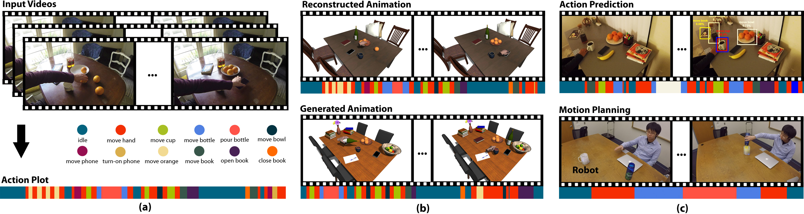

# Learning a Generative Model for Multi-Step Human-Object Interactions from Videos
This is an tensorflow implementation of Action Plot RNN in the Eurographics 2019 paper, Learning a Generative Model for Multi-Step Human-Object Interactions from Videos. The model generates action plots. 



The repository includes:

* Source code of Action Plot RNN.
* Training code
* Pre-trained weights
* Sampling code for generating action plots

# Requirements
* Python 3.5
* Tensorflow 1.3.0
* tflearn
* cPickle

# Training
```
# Train a new model starting from pre-trained COCO weights
python3 train.py
```

# Generation

